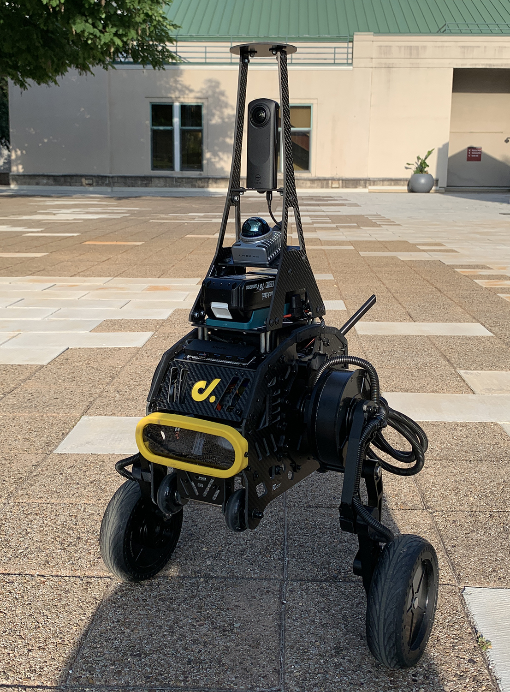
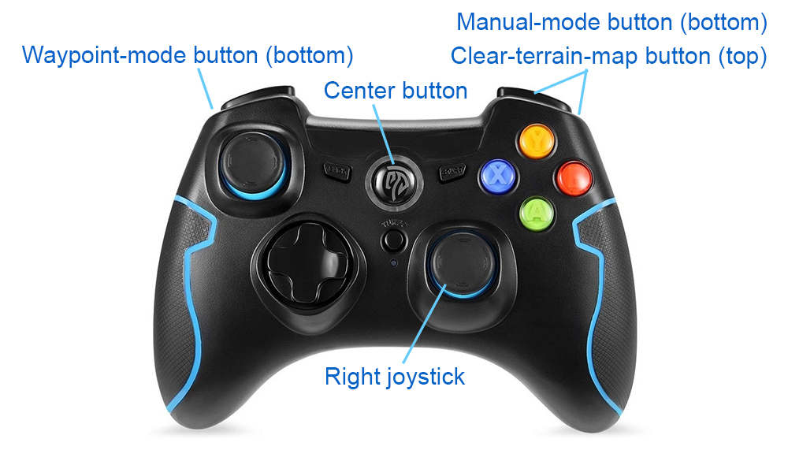
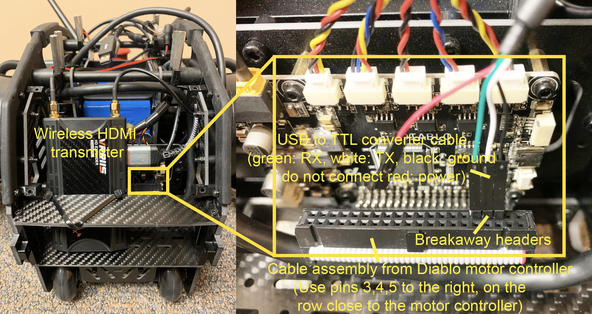
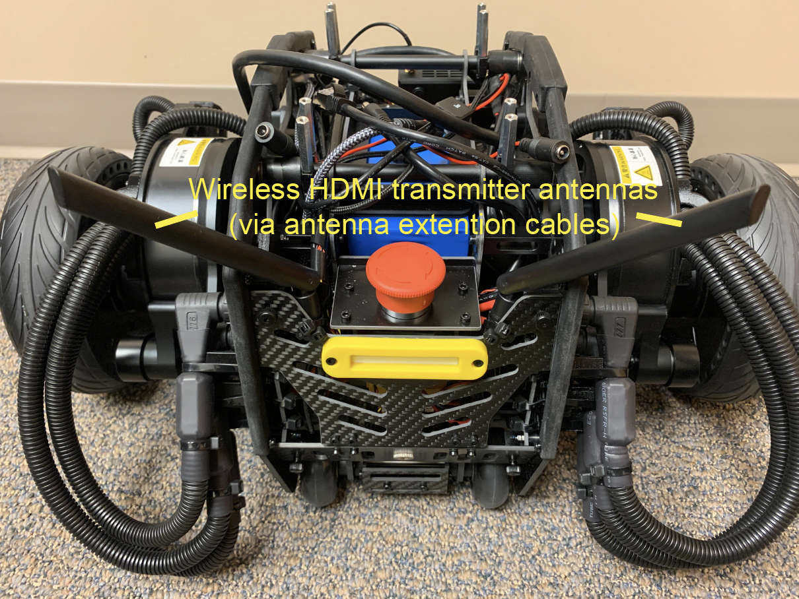
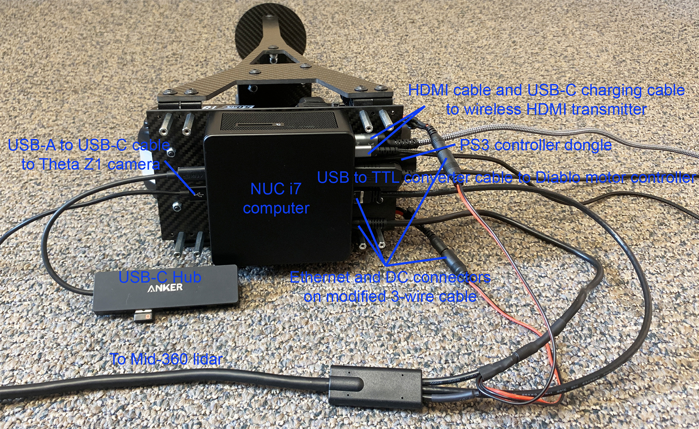
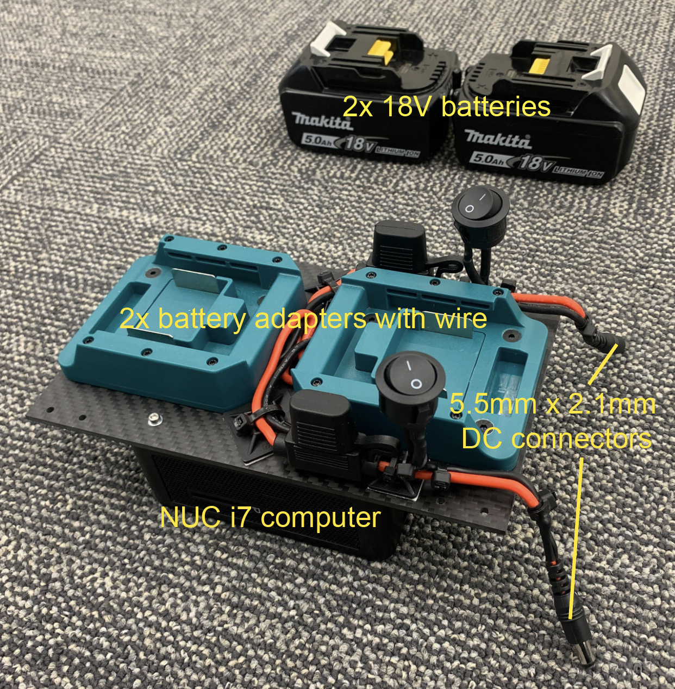
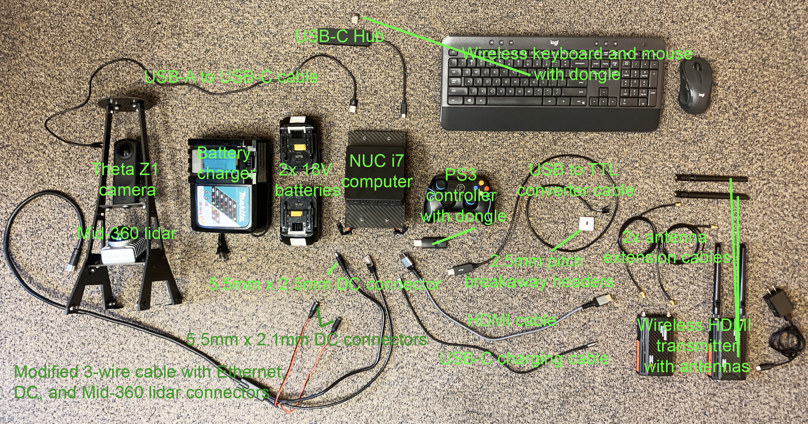
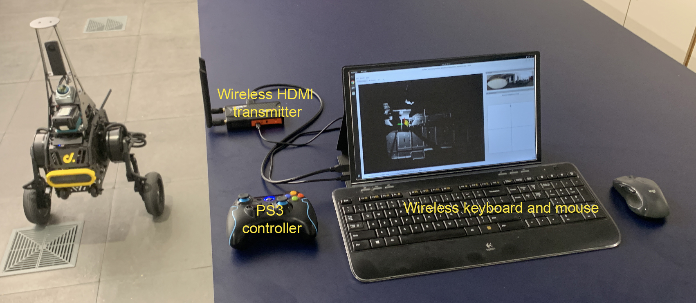
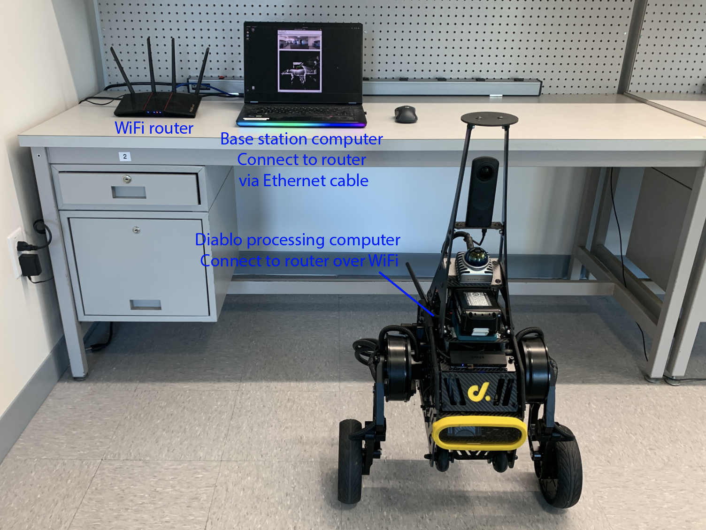

The repository contains the full autonomy stack for a system setup based on the [Direct Drive Tech's Diablo platform](https://shop.directdrive.com/products/diablo-world-s-first-direct-drive-self-balancing-wheeled-leg-robot). Sensors installed on the platform include a [Livox Mid-360 lidar](https://www.livoxtech.com/mid-360) and a [Ricoh Theta Z1 camera](https://us.ricoh-imaging.com/product/theta-z1), where the lidar is used by the autonomy stack. The autonomy stack contains a SLAM module, a route planner, an exploration planner, and a based autonomy system, where the base autonomy system further includes fundamental navigation modules for terrain traversability analysts, collision avoidance, and waypoint following. The system overall is capable of taking a goal point and navigating Diablo autonomously to the goal point as well as exploring an environment and building a map along the way. Alternatively, the system allows users to use a joystick controller to guide the navigation while the system itself is in charge of collision avoidance. We provide a simulation setup together with the real robot setup for users to take advantage of the system in various use cases. A tutorial about setting up the software and hardware is also provided to make it easier for users to replicate the system.

<p align="center">
  
</p>

## Simulation Setup

### Base Autonomy

The system is integrated with [Unity](https://unity.com) environment models for simulation. The repository has been tested in Ubuntu 22.04 with [ROS2 Humble](https://docs.ros.org/en/humble/Installation.html). After installing ROS2 Humble, add 'source /opt/ros/humble/setup.bash' to the '~/.bashrc' file and `source ~/.bashrc` in the terminal to engage the installation.
```
echo "source /opt/ros/humble/setup.bash" >> ~/.bashrc
source ~/.bashrc
```
Install dependencies with the command lines below.
```
sudo apt update
sudo apt install libusb-dev ros-humble-desktop-full ros-humble-tf-transformations ros-humble-joy python3-colcon-common-extensions python-is-python3 python3-pip git
pip install transforms3d pyyaml
```
Clone the open-source repository.
```
git clone https://github.com/jizhang-cmu/autonomy_stack_diablo_setup.git

```
In a terminal, go to the folder, checkout the 'humble' branch, and compile. Note that this skips the SLAM module, Mid-360 lidar driver, and Theta Z1 camera driver. The three packages are not needed for simulation.
```
cd autonomy_stack_diablo_setup
git checkout humble
colcon build --symlink-install --cmake-args -DCMAKE_BUILD_TYPE=Release --packages-skip arise_slam_mid360 arise_slam_mid360_msgs livox_ros_driver2 receive_theta
```
Download a [Unity environment model for Diablo setup](https://drive.google.com/drive/folders/1vAsyT_g1kLnexpgNawolVu3CO2NHYDB-?usp=sharing) and unzip the files to the 'src/base_autonomy/vehicle_simulator/mesh/unity' folder. The environment model files should look like below. For computers without a powerful GPU, please try the 'without_360_camera' version for a higher rendering rate.

mesh/<br>
&nbsp;&nbsp;&nbsp;&nbsp;unity/<br>
&nbsp;&nbsp;&nbsp;&nbsp;&nbsp;&nbsp;&nbsp;&nbsp;environment/<br>
&nbsp;&nbsp;&nbsp;&nbsp;&nbsp;&nbsp;&nbsp;&nbsp;&nbsp;&nbsp;&nbsp;&nbsp;Model_Data/ (multiple files in the folder)<br>
&nbsp;&nbsp;&nbsp;&nbsp;&nbsp;&nbsp;&nbsp;&nbsp;&nbsp;&nbsp;&nbsp;&nbsp;Model.x86_64<br>
&nbsp;&nbsp;&nbsp;&nbsp;&nbsp;&nbsp;&nbsp;&nbsp;&nbsp;&nbsp;&nbsp;&nbsp;UnityPlayer.so<br>
&nbsp;&nbsp;&nbsp;&nbsp;&nbsp;&nbsp;&nbsp;&nbsp;&nbsp;&nbsp;&nbsp;&nbsp;AssetList.csv (generated at runtime)<br>
&nbsp;&nbsp;&nbsp;&nbsp;&nbsp;&nbsp;&nbsp;&nbsp;&nbsp;&nbsp;&nbsp;&nbsp;Dimensions.csv<br>
&nbsp;&nbsp;&nbsp;&nbsp;&nbsp;&nbsp;&nbsp;&nbsp;&nbsp;&nbsp;&nbsp;&nbsp;Categories.csv<br>
&nbsp;&nbsp;&nbsp;&nbsp;&nbsp;&nbsp;&nbsp;&nbsp;map.ply<br>
&nbsp;&nbsp;&nbsp;&nbsp;&nbsp;&nbsp;&nbsp;&nbsp;object_list.txt<br>
&nbsp;&nbsp;&nbsp;&nbsp;&nbsp;&nbsp;&nbsp;&nbsp;traversable_area.ply<br>
&nbsp;&nbsp;&nbsp;&nbsp;&nbsp;&nbsp;&nbsp;&nbsp;map.jpg<br>
&nbsp;&nbsp;&nbsp;&nbsp;&nbsp;&nbsp;&nbsp;&nbsp;render.jpg<br>

In a terminal, go to the repository folder and launch the system.
```
./system_simulation.sh
```
After seeing data showing up in RVIZ, users can use the 'Waypoint' button to set waypoints and navigate the vehicle around. Note that the waypoints are meant to be relatively close to the vehicle. Setting the waypoint too far can cause the vehicle to get stuck at a dead end. Users can also operate in *smart joystick mode* where the vehicle tries to follow joystick commands and also avoid collisions. To do this, users can use the control panel in RVIZ or a PS3/4 or Xbox controller with a USB or Bluetooth interface. When using the controller, users can also operate in *manual mode* without any collision avoidance. Detailed information about the operations in the three modes is below.

<p align="center">
  
</p>

- *Smart joystick mode (default)*: The vehicle tries to follow joystick commands and also avoid collisions. Use the control panel in RVIZ or the right joystick on the controller to set the speed and yaw rate. If the system is in another mode, doing so will switch the system to *smart joystick mode*.

- *Waypoint mode*: The vehicle tries to follow waypoints and also avoid collisions. Use the 'Waypoint' button in RVIZ to set a waypoint by first clicking the button and then clicking where the waypoint is to be set around the vehicle. If the system is in another mode, clicking the 'Resume Navigation to Goal' button in RVIZ switches the system to *waypoint mode*. Or, users can hold the 'waypoint-mode' button on the controller and use the right joystick to set the speed. If only holding the 'waypoint-mode' button, the system will use the speed sent in ROS messages.

- *Manual mode*: The vehicle tries to follow joystick commands without any collision avoidance. Pressing the 'manual-mode' button on the controller switches the system to *manual mode*. Then, use the right joystick to set the speed and yaw rate.

<p align="center">
  
  &nbsp;&nbsp;&nbsp;&nbsp;
  
</p>

Alternatively, users can run a ROS node to send a series of waypoints. In another terminal, go to the folder and source the ROS workspace, then run the ROS node with the command lines below. The ROS node sends navigation boundary and speed as well. Click the 'Resume Navigation to Goal' button in RVIZ, and the vehicle will navigate inside the boundary following the waypoints. More information about the base autonomy system is available on the [Autonomous Exploration Development Environment](https://www.cmu-exploration.com) website.
```
source install/setup.sh
ros2 launch waypoint_example waypoint_example.launch
```

### Route Planner

The route planner conducts planning in the global environment and guides the vehicle to navigate to a goal point. To launch the system with route planner, use the command line below.
```
./system_simulation_with_route_planner.sh
```
Users can send a goal point with the 'Goalpoint' button in RVIZ. The vehicle will navigate to the goal and build a visibility graph (in cyan) along the way. Areas covered by the visibility graph become free space. When navigating in free space, the planner uses the built visibility graph, and when navigating in unknown space, the planner attempts to discover a way to the goal. By pressing the 'Reset Visibility Graph' button, the planner will reinitialize the visibility graph. By unchecking the 'Planning Attemptable' checkbox, the planner will first try to find a path through the free space. The path will show in green. If such a path does not exist, the planner will consider unknown space together. The path will show in blue. By unchecking the 'Update Visibility Graph' checkbox, the planner will stop updating the visibility graph. When navigating with the route planner, the base system operates in *waypoint mode*. Users can click in the black box on the control panel to switch to *smart joystick mode*, or press the buttons on a joystick controller to switch to *smart joystick mode* or *manual mode*. To resume route planner navigation, click the 'Resume Navigation to Goal' button in RVIZ or use the 'Goalpoint' button to set a new goalpoint. More information about the route planner is available on the [FAR Planner website](https://github.com/MichaelFYang/far_planner).

<p align="center">
  
</p>

### Exploration Planner

The exploration planner conducts planning in the global environment and guides the vehicle to cover the environment. To launch the system with exploration planner, use the command line below.
```
./system_simulation_with_exploration_planner.sh
```
Click the 'Resume Navigation to Goal' button in RVIZ to start the exploration. Users can adjust the navigation boundary to constrain the areas to explore by updating the boundary polygon in the 'src/exploration_planner/tare_planner/data/boundary.ply' file. When navigating with the exploration planner, the base system operates in *waypoint mode*. Users can click in the black box on the control panel to switch to *smart joystick mode*, or press the buttons on a joystick controller to switch to *smart joystick mode* or *manual mode*. To resume exploration, click the 'Resume Navigation to Goal' button in RVIZ. Note that previously, due to usage of [OR-Tools](https://developers.google.com/optimization) library, the exploration_planner only supports AMD64 architecture. A recent upgrade to the library made it compatible with both AMD64 and ARM computers. On ARM computers, please download the corresponding [binary release](https://github.com/google/or-tools/releases) for the target platform, for example, [or-tools_arm64_debian-11_cpp_v9.8.3296.tar.gz](https://github.com/google/or-tools/releases/download/v9.8/or-tools_arm64_debian-11_cpp_v9.8.3296.tar.gz), extract it, and replace the 'include' and 'lib' folders under 'src/exploration_planner/tare_planner/or-tools'. More information about the exploration planner is available on the [TARE Planner website](https://github.com/caochao39/tare_planner).

<p align="center">
  
</p>

## Real-robot Setup

### Hardware

We aim to provide a simple and easy-to-build hardware setup with fewer custom-fabricated/modified parts. We use mainstream electronics available on the consumer market. The setup includes sensors, a processing computer, a wireless HDMI transmitter, a pair of wireless keyboard and mouse, and batteries to power up the electronics without draining Diablo's drive chain battery. The hardware setup wirelessly transmits signals to a control station, allowing users to work with Diablo in a way as a desktop computer - the computer moves around in the environment and communicates with the control station wirelessly. The two batteries are hot-swappable and can be unplugged one at a time without powering down the system.

The hardware setup includes a few custom-made parts. The sensor brackets are custom-fabricated carbon fiber parts. Please find [here the CAD models of the carbon fiber brackets](https://github.com/jizhang-cmu/autonomy_stack_diablo_setup/tree/humble/sensor_brackets). Mounting the electronics requires a custom-made carbon fiber board to replace the original top board of Diablo. The CAD model of the top board is provided with the carbon fiber brackets. The top board is lifted up for 3cm using 8x standoffs. When mounting the NUC i7 computer, take the bottom cover off the computer and use the 4x threaded holes to mount the computer upside down underneath the top board. The antennas of the wireless HDMI transmitter are extended using antenna extension cables. The Mid-360 lidar cable and the two battery adapter cables are custom-modified with 5.5mm x 2.1mm and 5.5mm x 2.5mm DC connectors attached. Further, the cable assembly from the motor controller board on Diablo is unplugged from the built-in Raspberry Pi computer with the Raspberry Pi computer removed. The cable assembly is then connected to the NUC i7 processing computer through a USB to TTL converter cable and three breakaway headers. The connection is for Diablo motion control. After wiring up the cables, you may apply hot glue to some of the connectors. Please see the images below for detailed information about the hardware setup.

<p align="center">
  
  &nbsp;&nbsp;
  
</p>

<p align="center">
  
  &nbsp;&nbsp;
  
</p>

<p align="center">
  
</p>

<p align="center">
  

</p>

Below is a list of the hardware items with an overall price of about $3K (not including Diablo, fabricated carbon fiber brackets, or the monitor).

- [Livox Mid-360 lidar](https://www.livoxtech.com/mid-360) (Order 3-wire cable together) <br>
- [Ricoh Theta Z1 camera](https://us.ricoh-imaging.com/product/theta-z1-51gb) <br>
- [Intel NUC i7 computer](https://www.amazon.com/gp/product/B09JZGT9KC) (Recommend for 32G RAM and 1TB SSD) <br>
- [Wireless HDMI transmitter](https://www.amazon.com/Wireless-Transmitter-Receiver-Streaming-Projector/dp/B09XQ65XWV) <br>
- [Wireless keyboard and mouse](https://www.amazon.com/gp/product/B0CBPNWCVS) <br>
- [PS3 controller](https://www.amazon.com/Wireless-PC-Controller-Joystick-Nintendo-Dual-Vibration/dp/B0B2R14VJB) <br>
- [USB to TTL converter cable](https://www.amazon.com/gp/product/B08BLKBK1K) <br>
- [2.5mm pitch breakaway headers](https://www.amazon.com/gp/product/B015KA0RRU) <br>
- [USB-C Hub](https://www.amazon.com/dp/B0CCDMR66Y) <br>
- [HDMI cable](https://www.amazon.com/Highwings-Braided-Cord-Supports-ARC-Compatible-Ethernet/dp/B07ZB3K5D8) <br>
- [USB-C charging cable](https://www.amazon.com/Charging-Braided-CarPlay-Compatible-Samsung/dp/B0CL4KLL5C) <br>
- [USB-A to USB-C cable](https://www.amazon.com/etguuds-Charger-Braided-Compatible-Samsung/dp/B0B8D4W6XT) <br>
- [2x 18V batteries](https://www.amazon.com/gp/product/B01J58O5LM) (Rated for 5A+, recommend for 100Wh+ together) <br>
- [Battery charger](https://www.amazon.com/Makita-DC18RC-Lithium-Ion-Optimum-Charger/dp/B00DVO32VQ) <br>
- [2x battery adapters with wire](https://www.amazon.com/gp/product/B086S47GZG) (Rated for 5A+) <br>
- [5.5mm x 2.1mm DC connector with wire](https://www.amazon.com/dp/B09XQZLM1Q) (Rated for 5A+) <br>
- [5.5mm x 2.5mm DC connector with wire](https://www.amazon.com/gp/product/B09JKNRHBZ) (Rated for 5A+) <br>
- [2x antenna extension cables](https://www.amazon.com/gp/product/B07T7V333N) <br>
- [Right angle brackets](https://www.amazon.com/dp/B0B38XKVP7) <br>
- [8x 30mm standoffs](https://www.mcmaster.com/91920A630) <br>
- [M2.5 x 35mm screws for the NUC i7 computer](https://www.mcmaster.com/91292A313) <br>
- [M3 x 8mm screws for the Mid-360 lidar](https://www.mcmaster.com/92137A250) <br>
- [M4 x 20mm screws for the battery adapter](https://www.mcmaster.com/91294A196) <br>
- [M5 x 10mm screws for the right angle bracket](https://www.mcmaster.com/92137A414) <br>
- [1/4-20 x 3/8" screws for the Theta Z1 camera and Wireless HDMI transmitter](https://www.mcmaster.com/91355A080) <br>
- [M2.5 washers for the NUC i7 computer](https://www.mcmaster.com/91166A190) <br>
- [M4 nuts for the battery adapter](https://www.mcmaster.com/94645A101) <br>
- [M5 nuts for the right angle bracket](https://www.mcmaster.com/94645A102) <br>
- [Dual lock tape](https://www.amazon.com/Industrial-Reclosable-Boats-Cars-Drones-Indoor-Outdoor-Waterproof/dp/B09FYBZ4Z1) <br>
- [3/4" zip tie mounts](https://www.amazon.com/Zip-Tie-Mounts-Adhesive-backed-anchors-Management/dp/B087C58WTV) <br>
- [1" zip tie mounts](https://www.amazon.com/Zip-Tie-Mounts-Adhesive-backed-anchors-Management/dp/B08Y6Q1H2Y) <br>
- [Zip ties](https://www.amazon.com/Hmrope-Premium-Plastic-Strength-Self-Locking/dp/B07TG9VMWY) <br>

### System Setup

On the processing computer, install [Ubuntu 22.04](https://releases.ubuntu.com/jammy), connect the computer to Internet, and install [ROS2 Humble](https://docs.ros.org/en/humble/Installation.html). After installation of ROS2 Humble, add 'source /opt/ros/humble/setup.bash' to the '~/.bashrc' file and `source ~/.bashrc` in the terminal to engage the installation, or use the command lines below. Add user to the dialout group by `sudo adduser 'username' dialout`. Then, reboot the computer. Optionally, configure BIOS and set the computer to automatically boot when power is supplied

```
echo "source /opt/ros/humble/setup.bash" >> ~/.bashrc
source ~/.bashrc
sudo adduser 'username' dialout
sudo reboot now
```

#### 1) All Dependencies

Please install dependencies with the command lines below before proceeding to the next setup steps.

```
sudo apt update
sudo apt install libusb-dev ros-humble-desktop-full ros-humble-tf-transformations ros-humble-joy python3-colcon-common-extensions python-is-python3 python3-pip git libceres-dev libgstreamer1.0-0 libgstreamer-plugins-base1.0-dev gstreamer1.0-plugins-base gstreamer1.0-plugins-good gstreamer1.0-plugins-bad gstreamer1.0-plugins-ugly gstreamer1.0-libav gstreamer1.0-tools gstreamer1.0-x gstreamer1.0-alsa gstreamer1.0-gl gstreamer1.0-gtk3 gstreamer1.0-qt5 gstreamer1.0-pulseaudio
pip install transforms3d pyyaml
```

#### 2) Mid-360 Lidar

First, clone the open-source repository and checkout the 'humble' branch.

```
git clone https://github.com/jizhang-cmu/autonomy_stack_diablo_setup.git
cd autonomy_stack_diablo_setup
git checkout humble
```

Next, install ‘Livox-SDK2’. In a terminal, go to the 'src/utilities/livox_ros_driver2/Livox-SDK2' folder in the repository and use the command lines below. More information about [‘Livox-SDK2’ can be found here](https://github.com/Livox-SDK/Livox-SDK2).

```
mkdir build && cd build
cmake ..
make && sudo make install
```

Now, compile the Mid-360 lidar driver. Note that the driver needs to be configured specifically to the lidar. In the 'src/utilities/livox_ros_driver2/config/MID360_config.json' file, under the 'lidar_configs' settings, set the IP to 192.168.1.1xx, where xx are the last two digits of the lidar serial number (you can find it on a sticker under a QR code on the lidar).

```
cd autonomy_stack_diablo_setup
colcon build --symlink-install --cmake-args -DCMAKE_BUILD_TYPE=Release --packages-select livox_ros_driver2
```

Connect the lidar to the Ethernet port on the processing computer and power it on. Set the processing computer IP to 192.168.1.5, with netmask 255.255.255.0 and gateway 192.168.1.1. The IP is specified in the same json file. At this point, you should be able to pin the lidar by `ping 192.168.1.1xx`. Then, launch the driver with RVIZ to view the scan data. More information about [the Mid-360 lidar driver is available here](https://github.com/Livox-SDK/livox_ros_driver2).

```
source install/setup.sh
ros2 launch livox_ros_driver2 rviz_MID360_launch.py
```

#### 3) Theta Z1 Camera

In a terminal, go to the 'src/utilities/receive_theta/dependency/libuvc-theta' folder and install 'libuvc-theta'. More information about ['libuvc-theta' can be found here](https://github.com/ricohapi/libuvc-theta).

```
mkdir build && cd build
cmake ..
make && sudo make install
sudo /sbin/ldconfig -v
```

Then, go to the 'src/utilities/receive_theta/dependency/gstthetauvc/thetauvc' folder and install 'gstthetauvc'. After installation, use `gst-inspect-1.0 thetauvcsrc` to check if the gstreamer plugin is valid. More information about ['gstthetauvc' can be found here](https://github.com/nickel110/gstthetauvc).

```
make && sudo make install
```

Plug the camera into the processing computer with the USB-A to USB-C cable (use USB-A port on the processing computer, please don't use USB-C port), turn on the camera, and set it to live video mode by clicking the 'Mode' button until you see 'LIVE' on the screen under the camera icon. Note that the camera will sleep after idling for a couple of minutes. Press the power button to wake it up. Make sure the screen is on meaning the camera is active. Use the command line below to view images.

```
gst-launch-1.0 -v thetauvcsrc ! h264parse ! decodebin ! autovideosink
```

Now, compile the Theta Z1 camera driver. 

```
cd autonomy_stack_diablo_setup
colcon build --symlink-install --cmake-args -DCMAKE_BUILD_TYPE=Release --packages-select receive_theta
```

Launch the driver with images shown on the screen. Make sure the camera is still active and in live video mode.

```
source install/setup.sh
ros2 launch receive_theta receive_theta.launch showImage:=true
```

Please remember to power off the camera afterward to save battery.

#### 4) SLAM Module

In a terminal, go to the 'src/slam/dependency/Sophus' folder and install 'Sophus'.

```
mkdir build && cd build
cmake .. -DBUILD_TESTS=OFF
make && sudo make install
```

Then, go to the 'src/slam/dependency/gtsam' folder and install 'gtsam'. More information about [GTSAM is available here](https://gtsam.org).

```
mkdir build && cd build
cmake .. -DGTSAM_USE_SYSTEM_EIGEN=ON -DGTSAM_BUILD_WITH_MARCH_NATIVE=OFF
make -j6 && sudo make install
sudo /sbin/ldconfig -v
```

Now, compile the SLAM module. Note that the Mid-360 lidar driver is a dependency of the SLAM module. Please make sure it is already compiled.

```
cd autonomy_stack_diablo_setup
colcon build --symlink-install --cmake-args -DCMAKE_BUILD_TYPE=Release --packages-select arise_slam_mid360 arise_slam_mid360_msgs
```

#### 5) Diablo

Connect the serial cable on Diablo to the processing computer via the USB to TTL converter cable. It uses the breakaway headers to bridge it to the serial cable. Determine the serial device on the processing computer. You may list all the entries by `ls /dev`. The device is likely registered as '/dev/ttyUSB0' or '/dev/ttyUSB1'... In the 'src/utilities/diablo_ros2/diablo_interaction/diablo_ctrl/src/diablo_ctrl.cpp' file, update the '/dev/ttyUSB0' entry on line 104 and compile the Diablo driver.

```
cd autonomy_stack_diablo_setup
colcon build --symlink-install --cmake-args -DCMAKE_BUILD_TYPE=Release --packages-select diablo_body diablo_utils diablo_ctrl diablo_teleop diablo_teleop_joy ception_msgs motion_msgs
```

Take the PS3 controller and plug the USB dongle into the processing computer. Some controllers have different modes. Make sure the controller is in the right mode (usually the factory default mode) and is powered on. For this particular controller, the two LEDs on top of the center button should be lit to indicate the right mode. Holding the center button for a few seconds changes the mode. Now, power on Diablo. On the built-in controller, set the lower-right button to the center position (low-speed mode) and the lower-left button to the down position (creeping mode). After powering on Diablo, flip the lower-left button to the center position so that Diablo stands up. Please refer to the [Diablo manual for the detailed operation procedures](https://flbook.mwkj.net/c/9mHX61HDQD). Use the command lines below to launch the teleoperation test.

```
source install/setup.sh
ros2 launch diablo_teleop_joy diablo_teleop_joy.launch
```

To start the teleoperation test, flip the lower-right button on the built-in controller to the down position to release control. At this point, Diablo can be commanded by ROS messages taking input from the PS3 controller. Users can use the right joystick on the PS3 controller to command the speed and yaw rate and push the left joystick down to adjust the chassis height. The teleoperation test automatically keeps the chassis level. Be cautious and drive slowly at the beginning. Any time during the teleoperation test, users can take over control by flipping the lower-right button on the built-in controller to the center or up position (center position for low speed and up position for high speed).

<p align="center">
  
</p>

#### 6) Full Repository

After completion of the above setup steps, you can compile the full repository.

```
cd autonomy_stack_diablo_setup
colcon build --symlink-install --cmake-args -DCMAKE_BUILD_TYPE=Release
```

### System Usage

Power on the hardware including the sensors, processing computer, and Diablo. Make sure the Theta Z1 camera is active and in live video mode. Use the built-in controller to set Diablo to standing mode following the same procedure as in the System Setup - 4) Diablo section. In a terminal, go to the repository folder and use the command line below to launch the system. This launches the SLAM module and the base autonomy system together with the sensor and Diablo drivers.

```
./system_real_robot.sh
```

Now, flip the lower-right button on the built-in controller to the down position to release control. At this point, Diablo can be commanded by ROS messages from the system. Users can follow the same operations as in the simulation setup to navigate Diablo in the environment. Please refer to the Simulation Setup section for operating the system in the *smart joystick mode*, *waypoint mode*, and *manual mode* using a combination of the 'waypoint' button and control panel in RVIZ and the PS3 controller. Note that the system commands Diablo to drive only when it is in standing mode. During autonomous navigation, if it exits standing mode, e.g accidentally falling down, use the built-in controller to stand it up and then release control, the autonomous navigation will resume.

<p align="center">
  
</p>

To launch the system with route planner or exploration planner, use the command lines below. Follow the same procedures as in the Simulation Setup section to operate the system.

For route planner:
```
./system_real_robot_with_route_planner.sh
```
For exploration planner:
```
./system_real_robot_with_exploration_planner.sh
```

<p align="center">
  
</p>

<p align="center">
  
</p>

To record the sensor data to a bagfile, source the ROS workspace (due to custom format for the scan messages) and use the command lines below in another terminal while the system is running.

```
source install/setup.bash
ros2 bag record /imu/data /lidar/scan /camera/image -o 'bagfolder_path'
```

To launch the system for bagfile processing, use of the command lines below.

For base system:
```
./system_bagfile.sh
```
For route planner:
```
./system_bagfile_with_route_planner.sh
```
For exploration planner:
```
./system_bagfile_with_exploration_planner.sh
```

In another terminal, source the ROS workspace (required) and play the bagfile.

```
source install/setup.bash
ros2 bag play 'bagfolder_path/bagfile_name.db3'
```

[A few example bagfiles are provided here](https://drive.google.com/drive/folders/1vAsyT_g1kLnexpgNawolVu3CO2NHYDB-?usp=sharing). Users can use the bagfiles to test the system offline without accessing the real-robot setup. Note that for bagfile processing, please follow the System Setup section above to compile the repository fully.

## Notes

- In simulation, the bridge between Unity and the system is not completely stable. At the system launch, if you see an error regarding 'ros_tcp_endpoint', simply try for a second time.

- If the PS3 controller is not recognized correctly at the power on of the processing computer, unplug and re-plug in the USB dongle.

- The sensor configuration leaves 1.2m of blind area in front of the vehicle at ground level. If something low jumps into the area, the system would not know.

- Occasionally, we observe SLAM drift which can cause issues with the terrain map and collision avoidance. Symptoms are vehicle getting stuck or moving in strange directions and not following waypoints. Users can press the 'clear-terrain-map button' on the joystick controller to reset the terrain map. At the system start up, if the SLAM module gives a warning saying the lidar and IMU data are out of synchronization, please restart the system.

- The two batteries are directly connected. Please avoid plugging in a fully charged battery and an empty battery together. We recommend always plugging in two fully charged batteries at the same time so that their voltages are the same. For hot swapping, please quickly replace one battery after the other with fully charged batteries. Alternatively, you may keep only one battery plugged in. For this hardware setup, a battery can last for about 1.5 hours. If Diablo is stationary for a while, you may use the power supply coming in with the NUC i7 computer to power the sensors and computer. Simply unplug the battery adapter at the 5.5mm x 2.1mm DC connectors and plug in the power supply. When switching between the power supply and batteries, please shut down the system.

- The system only commands Diablo to drive when it is in standing mode. For debugging, users can source the ROS workspace in a terminal and use 'ros2 topic echo /diablo/sensor/Body_state' to inspect the status when the driver ('diablo_ctrl_node' node) is running. In standing mode, users should see 'robot_mode_msg = 3'.

- For the Theta Z1 camera, please connect it to a USB-A port on the processing computer via a USB-A to USB-C cable. The driver can have issues if connected to a USB-C port. Occasionally, if the camera is stuck in an erroneous mode with with blinking red light, hold the power button and Wifi/Bluetooth button together for a few seconds to force shut down. Then press the power button again to power it on.

- For the Theta Z1 camera driver, in the 'src/utilities/receive_theta/launch/receive_theta.launch' file, the image top/bottom margin is set to 'TopBottonMargin = 160', cropping from 960 pixels at 180 degs to 640 pixels at 120 degs vertically. Set 'imageLatency' to adjust image message timestamps if needed. If using the driver on ARM computers, change line 65 in the 'src/utilities/receive_theta/src/receiveTheta.cpp' file to 'VideoCapture video("thetauvcsrc ! h264parse ! decodebin ! nvvidconv ! video/x-raw, format=(string)BGRx ! videoconvert ! video/x-raw, format=(string)BGR ! appsink");'. On some computers, you may need to change the installation directory from '/usr/lib/x86_64-linux-gnu/gstreamer-1.0' to '/usr/lib/gstreamer-1.0' in the makefile of 'gstthetauvc'. The image framerate is set to 10Hz ('skipFrameNum = 2') in 'gstthetauvcsrc.c'. It can be set up to 30Hz. The image resolution is set to FHD (1920 * 960) by default in 'thetauvc.h'. It can be set to UHD (3840 * 1920). If changing these settings, please remake and reinstall 'gstthetauvc'.

- The route planner and exploration planner are provided with indoor and outdoor configurations. To change the configuration, go to the 'src/base_autonomy/vehicle_simulator/launch' folder and find 'route_planner_config' in the 'system_unity_with_route_planner.launch', 'system_real_robot_with_route_planner.launch', and 'system_bagfile_with_route_planner.launch' files, and 'exploration_planner_config' in the 'system_unity_with_exploration_planner.launch', 'system_real_robot_with_exploration_planner.launch', and 'system_bagfile_with_exploration_planner.launch' files. Users can configure the settings for Unity simulation, real-robot deployment, and bagfile processing differently in the launch files. The default is set to indoor for both planners.

- The speed is set in the 'src/base_autonomy/local_planner/launch/local_planner.launch' file. The 'maxSpeed' defines the maximum speed in all modes and 'autonomySpeed' defines the speed in *waypoint mode*. Please be extra cautious when increasing the speed.

- In indoor environments, to avoid low obstacles, users can reduce 'obstacleHeightThre' in the 'src/base_autonomy/local_planner/launch/local_planner.launch' file from 0.15 to as small as 0.015 or 0.02. The vehicle will avoid obstacles at 2-2.5cm above ground. Please set the threshold higher (0.1-0.15) in outdoor environments.

- To save a point cloud file during a run, users can set 'savePcd = true' in the 'src/base_autonomy/visualization_tools/launch/visualization_tools.launch' file. A 'pointcloud_xxx.txt' file is saved in the 'src/base_autonomy/vehicle_simulator/log' folder together with a trajectory file, where 'xxx' is the timestamp. The format is described in the 'readme.txt' file in the same folder. Once a point cloud file is saved, users can start the SLAM module in localization mode. Copy the point cloud file to the desktop and rename it 'pointcloud_local.txt'. Then, in the 'src/slam/arise_slam_mid360/config/livox_mid360.yaml' file, set 'local_mode = true' and adjust 'init_x', 'init_y', 'init_z', 'init_yaw' for the start pose.

## Extension - WiFi Transmission

The extension wirelessly transmits data to a base station computer installed with Ubuntu 22.04 and [ROS2 Humble](https://docs.ros.org/en/humble/Installation.html), allowing users to run advanced AI models on the base station computer with powerful GPUs, for example. The setup involves a high-speed WiFi router. The model tested is an [ASUS RT-AX55 WiFi router](https://www.amazon.com/ASUS-AX1800-WiFi-Router-RT-AX55/dp/B08J6CFM39). Configure the router and set up the subnet. We recommend using automatic IP and setting the subnet address to 10.1.1.x (please avoid the 192.168.1.x subnet as being used by the Mid-360 lidar, and do not connect the router to the internet). Connect the base station computer to the router with an Ethernet cable and the Diablo processing computer to the router over WiFi, both using 'Automatic (DHCP)'. Make sure both computers are on the same subnet and can ping each other. On the Diablo processing computer, use the command lines below to increase the message buffer size. Then, you can use `sysctl net.core.rmem_max` and `sysctl net.core.wmem_max` to check the buffer size.
```
sudo sysctl -w net.core.rmem_max=67108864 net.core.rmem_default=67108864
sudo sysctl -w net.core.wmem_max=67108864 net.core.wmem_default=67108864
```
Start the Diablo system. On the base station computer, users should be able to list all the topics using `ros2 topic list`. In a terminal on the Diablo processing computer, go to the repository folder, source the ROS workspace, and launch the domain bridge. This shares a few topics to the base station computer domain (ROS_DOMAIN_ID=1).
```
source install/setup.bash
ros2 launch domain_bridge diablo_bridge.launch
```
In a terminal on the base station computer, use `export ROS_DOMAIN_ID=1` followed by `ros2 topic list` to list the topics shared to the base station computer domain. Now, copy the 'base_station' folder in the repository to the base station computer. In a terminal, go to the folder and use the command line below to launch RVIZ and view data transmitted over the network.
```
./base_station.sh
```
Users can set up AI models on the base station computer to process the transmitted data and send waypoints back to guide the navigation. When launching the AI model, please set `export ROS_DOMAIN_ID=1` in the terminal. Note that the data transmission sends compressed images to the base station computer. The images are then uncompressed in the 'base_station.sh' script. Please make sure to subscribe to the uncompressed images on the '/camera/image/transmitted' topic. Subscribing to the original images on the '/camera/image' topic can overload the network. If experiencing high image latency over the network, users can try reducing 'compQuality' in the 'src/utilities/receive_theta/launch/receive_theta.launch' file. If accessing internet on the base station computer at the same time, users can connect the base station computer to internet over WiFi and then in the wired network settings, under IPv4 tab, check "use this connection only for resources on its network".

<p align="center">
  
</p>

## About SLAM Module

The full-blown ARISE SLAM fuses IMU, image, and scan data in an adaptive pipeline. A learning-based IMU model seeds image and scan processing, and the latter inversely strengthens the IMU model adapting it to the current settings. When sensing degradation happens in the environment, the pipeline automatically and dynamically reconfigures to keep itself robust. Especially, when both image and scan processing degrades, the pipeline reduces to the IMU model and relies on it to survive. This repository contains a slimmed version of ARISE SLAM for lightweight processing, adapted to the Mid-360 lidar. More information about the full-blown version will be released soon.

## Main Contributors

[Shibo Zhao](https://shibowing.github.io), [Botao He](https://github.com/Bottle101), [Guofei Chen](https://gfchen01.cc), [Chao Cao](https://caochao.me), [Sam Shum](https://github.com/supercrazysam), and [Ji Zhang](https://frc.ri.cmu.edu/~zhangji)

## Credits

The project is sponsored by the [National Robotics Engineering Center](https://www.nrec.ri.cmu.edu) at Carnegie Mellon University.

[gtsam](https://gtsam.org), [Sophus](http://github.com/strasdat/Sophus.git), [domain_bridge](https://github.com/ros2/domain_bridge), [livox_ros_driver2](https://github.com/Livox-SDK/livox_ros_driver2), [Livox-SDK2](https://github.com/Livox-SDK/Livox-SDK2), [libuvc-theta](https://github.com/ricohapi/libuvc-theta), [gstthetauvc](https://github.com/nickel110/gstthetauvc), [diablo_ros2](https://github.com/DDTRobot/diablo_ros2), and [ROS-TCP-Endpoint](https://github.com/Unity-Technologies/ROS-TCP-Endpoint) packages are from open-source releases.

## Relevant Links

The SLAM Module is based on ARISE SLAM (link available soon).

The base autonomy system is based on [Autonomous Exploration Development Environment](https://www.cmu-exploration.com).

The route planner is based on [FAR Planner](https://github.com/MichaelFYang/far_planner).

The exploration planner is based on [TARE Planner](https://github.com/caochao39/tare_planner).

<p align="center">
  
</p>
